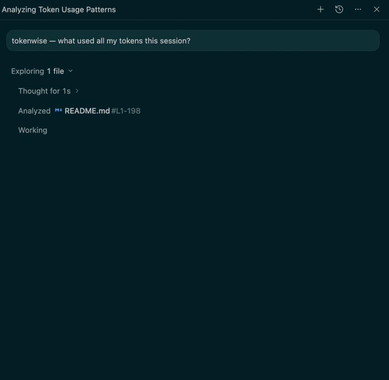

<div align="center">

# 🪙 tokenwise

**See exactly what an AI agent session (Claude Code or Antigravity) cost you — in tokens _and dollars_ — and how to spend less.**

`tokenwise` runs a tiny local analyzer over your session transcript (main **and** subagents) and shows you the real cost drivers: big tool results that re-bill on every later turn, redundant file reads, runaway subagents, and cache efficiency — then turns that into concrete, prioritized cuts.

The best part: the heavy parsing happens in a **zero-dependency Python script**, so your agent only reads a compact summary. The tool that tells you to stop dumping data into context doesn't dump data into context.

[Install](#install) · [What you get](#what-you-get) · [How it works](#how-it-works) · [Why it's different](#why-its-different) · [FAQ](#faq)

     



</div>

---

## What is this?

A [Claude Code Skill](https://docs.claude.com/en/docs/claude-code/skills). Install once, then in any project ask:

> **"tokenwise — what used all my tokens this session?"**

Your AI agent runs the local analyzer on your transcript and hands back a short, quantified report plus specific fixes — like a cost profiler for your AI sessions.

It is **100% read-only** — it only reads the transcript files your agent natively writes to `~/.claude/projects/` or `~/.gemini/antigravity-ide/brain/`.

## The insight it's built on

In an agent loop, **every tool result stays in context and is re-sent on every following turn.** So a single big file read early in a long session isn't paid once — it's paid on all the turns after it. That compounding is where sessions quietly balloon to hundreds of thousands of tokens. tokenwise ranks findings by **compounding footprint** (size × turns it stayed in context), not just raw size — so you fix the thing that actually costs money.

## What you get

Real output from analyzing the very session that built this tool:

```
TOKENWISE REPORT  (token counts are estimates: transcript chars ÷ 4)
Files analyzed: 1  (main: 1, subagents: 0)
Models: claude-opus-4-8

── TOTALS ──
Assistant turns: 245
Output (generated) tokens: 301,820
Input — uncached: 44,190 | cache-created: 2,381,164 | cache-read: 26,157,627
Total tokens processed (billed mix): 28,884,801   | cache-read share: 92%

── COST (exact — from usage fields, at listed $/MTok rates) ──
Estimated session cost: $42.71    |    cache-efficiency grade: A (92% served from cache)

── HIGHEST COMPOUNDING FOOTPRINT ── size × turns it stayed in context (the real cost driver)
1. [Read] manual-test-verifier.md — ~4.9k tok × 235 turns ≈ 1155.3k tok-turns
2. [Read] qa-reviewer-agent.md — ~1.7k tok × 236 turns ≈ 412.8k tok-turns
...

── REDUNDANT READS (same file read ≥2×) ──
• README.md — 3× (/Users/…/README.md)

── BIGGEST WIN ──
Reading [Read] manual-test-verifier.md early cost ~$0.58 in cache re-reads (~1155k tok-turns).
Reading only the needed span (say ~10% of it) would reclaim most of that.
```

…and then your agent translates that into prioritized, **dollar-valued** fixes:
- *"This session cost **$42.71** (grade A). The single biggest win: reading `manual-test-verifier.md` early cost ~$0.58 in cache re-reads — read the span, not the whole file."*
- *"`README.md` was read 3× — it was already in context after the first."*
- *"92% cache-read share — this session cached well; the win is smaller early reads, not caching."*

## Install

### One-liner (user scope — available in every project)

```sh
# For Claude Code (default):
git clone https://github.com/lohani-mohit/tokenwise.git && ./tokenwise/install.sh

# For Antigravity IDE:
git clone https://github.com/lohani-mohit/tokenwise.git && ./tokenwise/install.sh --platform antigravity
```

### Manual

**For Claude Code:**
```sh
cp -r tokenwise/skills/tokenwise ~/.claude/skills/       # user scope (all projects)
# or: cp -r tokenwise/skills/tokenwise .claude/skills/    # this repo only
```

**For Antigravity IDE:**
```sh
cp -r tokenwise/skills/tokenwise ~/.gemini/config/skills/ # user scope (all projects)
# or: cp -r tokenwise/skills/tokenwise .agents/skills/    # this repo only
```

Restart your agent session (or run `/skills` / reload skills) and tokenwise is available.

> **Requirements:** Claude Code or Antigravity IDE + Python 3. No other dependencies.

## Usage

```
tokenwise — what used all my tokens this session?
tokenwise: profile this session and tell me how to make it cheaper
tokenwise on ~/.claude/projects/<project>/<session>.jsonl
why was that agent so expensive?
```

You can also run the analyzer directly, without an agent:

```sh
python3 ~/.claude/skills/tokenwise/scripts/analyze.py [--platform <name>]                 # this project's latest session (+ subagents)
python3 ~/.claude/skills/tokenwise/scripts/analyze.py [--platform <name>] <file|dir>      # a specific transcript or session dir
python3 ~/.claude/skills/tokenwise/scripts/analyze.py [--platform <name>] --trend         # cost across ALL sessions in this project
python3 ~/.claude/skills/tokenwise/scripts/analyze.py [--platform <name>] --json [target] # machine-readable (for CI cost gates)
```

### Track cost over time

`--trend` sweeps every session in a project and prints a dated cost table plus your most expensive session:

```
TOKENWISE TREND  —  2 sessions in ~/.claude/projects/<project>
Total across all sessions: $54.08

date        cost      turns  grade  session
2026-07-01    $51.69    302      A  d5dfb70a
2026-06-23     $2.39     18      C  30db4e51

Most expensive session: $51.69 (302 turns, grade A) — d5dfb70a
```

### CI cost gate

`--json` emits structured output you can wire into CI to fail a build that ran too expensive:

```sh
COST=$(python3 .../analyze.py --json | python3 -c 'import sys, json; print(json.load(sys.stdin)["cost_usd"])')
awk "BEGIN{exit !($COST > 5.00)}" && echo "::error::session cost \$$COST exceeded \$5.00 budget" && exit 1
```

## How it works

```
   you: "tokenwise this session"
              │
     ┌────────▼─────────┐
     │  analyze.py       │   parses the transcript JSONL locally (main + subagents/):
     │  (local, 0 deps)  │   token totals, per-result sizes, compounding footprint,
     │                   │   redundant reads, cache share, subagent split
     └────────┬─────────┘
              │  prints ONE compact report (a few KB)
     ┌────────▼─────────┐
     │  Agent reads      │   interprets the numbers → prioritized, quantified fixes
     │  only the summary │   + the single biggest win
     └───────────────────┘
```

```
skills/tokenwise/
├── SKILL.md               # short orchestrator (tells the agent to run the script, not read transcripts)
└── scripts/
    └── analyze.py         # zero-dependency Python analyzer — does all the heavy parsing locally
```

## Why it's different

- **Real dollars, computed exactly** — not a token count you have to price yourself. It reads the transcript's exact `usage` fields (including the 5-minute vs 1-hour cache-write split) and applies per-model rates, then hands you a session cost, a per-model breakdown, a cache-efficiency grade, and **quantified savings opportunities** ("~$X reclaimable if you read spans, not whole files").
- **It profiles the right thing** — ranks by *compounding footprint*, not raw size, so you fix what actually costs money.
- **Sees subagents** — rolls up `subagents/*.jsonl` and shows how much spend happened off your main thread (often the real sink).
- **Cheap to run, by construction** — the analyzer is deterministic local code; the agent only reads a small summary. It practices what it preaches.
- **Zero dependencies, read-only** — just Python 3 reading files your agent already wrote.
- **Actionable, quantified** — every finding comes with a number and a specific fix, ending in the single biggest win.
- **Cost over time + CI-ready** — `--trend` charts spend per session across a whole project; `--json` drops straight into a CI cost gate that fails a build that ran too expensive.

## FAQ

**Are the token numbers exact?** No — they're estimates (transcript characters ÷ 4), and the report says so. The value is *relative magnitude and direction*: which reads/tools/agents dominated, and what to change. Per-turn billed totals (output / cache-created / cache-read) come straight from the transcript's `usage` fields and are exact.

**Does it send my transcript anywhere?** No. Everything is local and read-only.

**Where are transcripts?** Auto-detected based on your environment (e.g. `~/.claude/projects/...` or `~/.gemini/antigravity-ide/brain/...`). The analyzer finds them for you.

**Does it work on a specific agent run?** Yes — point it at that agent's `.jsonl`, or at a session directory to roll up everything.

## Contributing

Issues and PRs welcome — especially new cost heuristics (e.g. detecting large pasted blobs, chatty tool loops, or low-value re-greps). Keep the analyzer dependency-free.

## License

[MIT](./LICENSE) © Mohit Lohani

<div align="center">
<sub>Built after watching one skill quietly spend 135k tokens. If tokenwise saves you some, drop a ⭐.</sub>
</div>
